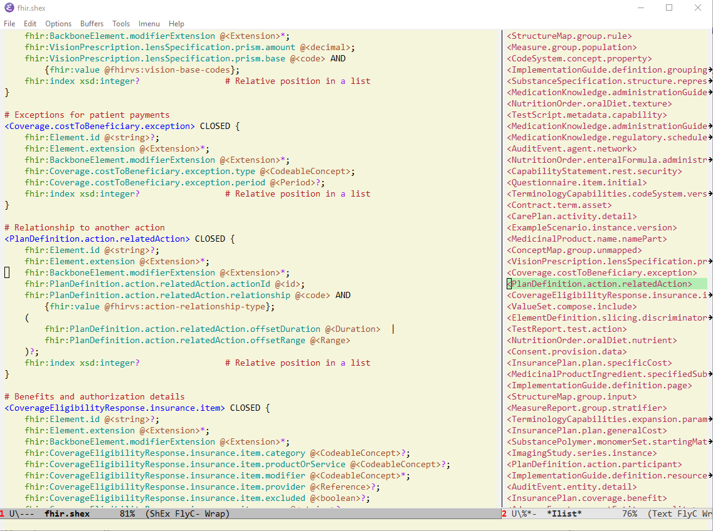

# shexc-mode-for-emacs
This is an emacs major mode for editing ShExC documents
originally created as N3-mode by Hugo Haas and Dave Pawson,
then adapted by Eric Prud'hommeaux and Vladimir Alexiev.

Put shexc-mode.el somewhere emacs can find it (e.g. ~/.emacs.d/vendor/),
and add the following to your .emacs file:
```lisp
;;
;; shexc mode
;;

(add-to-list 'load-path "{folder that contains shexc-mode.el}")
(autoload 'shexc-mode "shexc-mode" "Major mode for ShExC (ShEx Compact Syntax) files" t)

;; Turn on font lock when in shexc mode
(add-hook 'shexc-mode-hook
          'turn-on-font-lock)

(setq auto-mode-alist
      (append
       (list
        '("\\.shexc" . shexc-mode)
        '("\\.shex" . shexc-mode))
       auto-mode-alist))

;; Replace {path} with the full path to shexc-mode.el on your system.

;; If you want to make it load just a little faster;
;; C-x f shexc-mode.el
;; M-x byte-compile-file shexc-mode.el
```

You can also use `imenu` to make an index of shapes 
and [`imenu-list`](https://github.com/bmag/imenu-list) to see them in a panel on the right.

```lisp
(defun my-goto-function ()
  "Find the definition of the function/term at point."
  (interactive)
  (let ((sym (thing-at-point 'symbol)))
    (if sym (imenu sym)
      (call-interactively 'imenu))))
      
(autoload 'imenu-list-minor-mode "imenu-list" nil t)
(add-hook 'shexc-mode-hook 'imenu-add-menubar-index)
(add-hook 'shexc-mode-hook 'imenu-list-minor-mode)

(setq
  imenu-list-auto-resize nil ; fhir.shex has long shape names, so auto-resize doesn't work well
  imenu-list-size 0.3
  ;; imenu-list-focus-after-activation t
)

;; https://github.com/bmag/imenu-list/issues/31
(add-hook
 'imenu-list-major-mode-hook
 (defun my-imenu-list-major-mode-hook ()
   (setq-local truncate-lines t)
   (setq-local scroll-conservatively 0)
   (setq-local scroll-down-aggressively 1)
   (setq-local scroll-up-aggressively 1)))

;;; example key bindings
(global-set-key (kbd "C-x C-i") 'my-goto-function)
(global-set-key (kbd "C-x I") 'imenu-list-smart-toggle)

```
Eg here is the index of shapes for [fhir.shex](http://hl7.org/fhir/fhir.shex) shown in the right panel (buffer `*Ilist*`):


