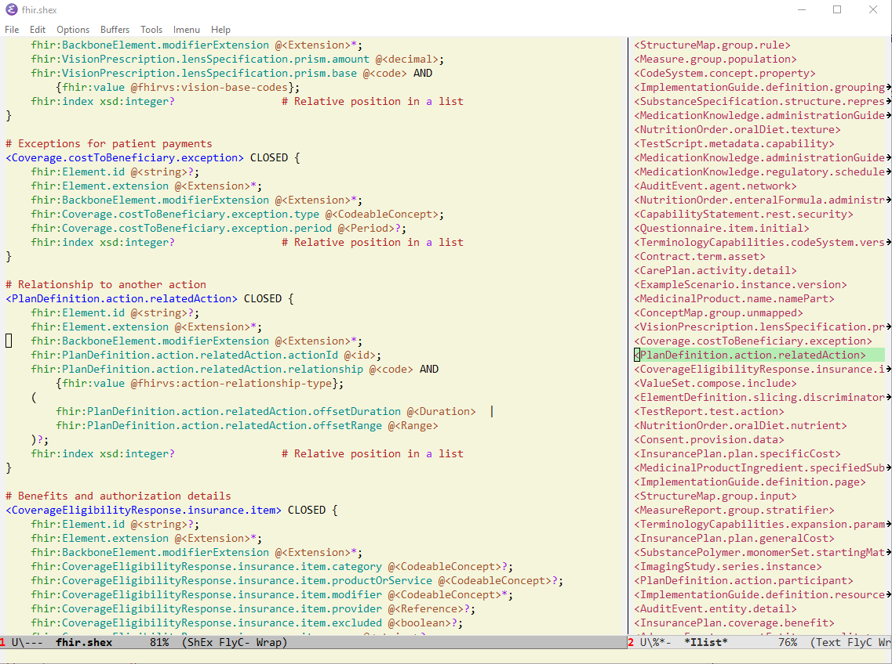

# shexc-mode-for-emacs

[](https://melpa.org/#/shexc-ts-mode)
[](https://github.com/ericprud/shexc-mode-for-emacs/releases)
[](LICENSE)

This repository hosts two Emacs 29+ tree-sitter major modes for RDF-family
languages, plus the shared infrastructure they're both built on:

- **[`shexc-ts-mode`](#shexc-ts-mode)** — for [ShExC](https://shex.io/shex-semantics/#shexc)
  (ShEx Compact Syntax), the schema language for validating RDF graphs.
- **[`turtle-ts-mode`](#turtle-ts-mode)** — for [Turtle](https://www.w3.org/TR/turtle/)
  (and, via the same grammar, TriG and N-Triples).
- **[`rdf-core`](#rdf-core)** — shared infrastructure (on-demand grammar
  install, prefix-map lookup, navigation helpers) the other two build on.
  Not meant to be used directly.

All three currently ship together as a single MELPA package,
`shexc-ts-mode` — see [Packaging](#packaging) for why and what's planned.

## shexc-ts-mode

`shexc-ts-mode` is a tree-sitter-based Emacs major mode for editing
[ShExC](https://shex.io/shex-semantics/#shexc) (ShEx Compact Syntax)
documents, built on the grammar at
[tree-sitter-shexc](https://github.com/ericprud/tree-sitter-shexc).


`shexc-ts-mode.el` provides:

- structure-aware indentation (`indent-region`, `indent-for-tab-command`/`TAB`)
- line and block commenting that knows about ShExC's nesting (`M-;` via `comment-dwim`)
- toggling between `#`-style and `/* */`-style comments (`C-c C-k`, see below)
- an `imenu` index of shape declarations (no extra setup needed; works with
  `imenu-list`, see [imenu and imenu-list](#imenu-and-imenu-list) below)
- "jump to shape definition" / "find references to shape" via `xref`
  (`M-.` / `M-,` / `M-?`), resolving `@<#Shape>`, `EXTENDS @<#Shape>`,
  `&<#Shape>` and `start = @<#Shape>` references to their declarations (see
  [Jumping to/from shape references](#jumping-tofrom-shape-references-xref)
  below)
- structural defun-nav (`C-M-a` / `C-M-e`) and smart sexp navigation
  (`C-M-f` / `C-M-b`, `C-M-t`, `kill-sexp`, ...) that treat each shape
  declaration, EXTENDS clause, AND/OR/NOT operand and `{ ... }` body as a unit
- a breadcrumb (`<Shape> > predicate > ...`) for `which-function-mode` /
  `add-log-current-defun`
- generic region expansion via `expreg`/`expand-region`, if installed — their
  tree-sitter-based expansion understands shexc's grammar with no
  shexc-specific configuration, but you do need to install one of the
  packages and bind its expand command yourself (see below)
- code folding of `{ ... }` shape bodies via `hs-minor-mode` (`C-c C-f`)
- renaming a shape label everywhere it's used (`C-c C-r`)
- `flymake` diagnostics (enabled automatically) for undefined shape
  references and (as an orientation aid) repeated predicates within one
  group
- live highlighting of the shapes reachable from the shape at point — via a
  sole reference, AND, OR, NOT, or EXTENDS (`C-c C-l` toggles it on/off; see
  [Extended-shape highlighting](#extended-shape-highlighting) for the
  terminology)
- in-place conversion of the shape/schema at point to ShExJ or ShExR and
  back (`C-c C-v`; see [ShExC/ShExJ/ShExR conversion](#shexcshexjshexr-conversion)
  below)
- a `transient` feature menu summarizing all of the above with live
  keybindings (`C-c C-c`)

### Keybindings at a glance

For a live, scrollable summary of these commands and their current
keybindings (which may differ if you've rebound things), press `C-c C-c`
to open the `transient` feature menu, or `C-h m` for the full mode
description.

| Key                 | Command                                  | What it does |
| ------------------- | ----------------------------------------- | ------------ |
| `M-;`               | `comment-dwim`                            | Comment/uncomment (knows both `#` and `/* */` styles) |
| `C-c C-k`           | `shexc-ts-mode-toggle-comment-style`      | Toggle which style new comments use |
| `C-c C-u`           | `shexc-ts-mode-unwrap-shape`              | Splice out a `<predicate> { ... }` wrapper |
| `C-c C-w`           | `shexc-ts-mode-wrap-in-shape`             | Wrap the region in a new `<predicate> { ... }` |
| `C-c C-r`           | `shexc-ts-mode-rename-shape`              | Rename a shape label everywhere it's used |
| `C-c C-p`           | `shexc-ts-mode-insert-prefix`             | Insert a `PREFIX` decl for the prefix at point |
| `C-c C-f`           | `shexc-ts-mode-toggle-fold`               | Fold/unfold the `{ ... }` body at point |
| `C-c C-l`           | `shexc-ts-mode-highlight-reachable-mode`  | Toggle reachable-shape highlighting on/off |
| `C-c C-v`           | `shexc-ts-mode-convert-at-point`          | Cycle the shape/schema at point ShExC → ShExJ → ShExR → ShExC |
| `C-c C-c`           | `shexc-ts-mode-menu`                      | Open the `transient` feature menu |
| `C-M-a` / `C-M-e`   | `beginning/end-of-defun`                  | Previous/next shape declaration |
| `C-M-f` / `C-M-b`   | `forward/backward-sexp`                   | Move across a shape/triple-expression branch |
| `C-M-t`             | `transpose-sexps`                         | Swap two adjacent branches |
| `M-.` / `M-,` / `M-?` | `xref-find-definitions`/`-go-back`/`-find-references` | Jump to/from/find refs to a shape |

### Setup

You'll need Emacs 29+ (built with tree-sitter support). `shexc-ts-mode` also
needs a compiled copy of the `tree-sitter-shexc` grammar, which is *not*
bundled with the package (MELPA only ships Lisp source, and a prebuilt binary
for every OS/architecture isn't practical) — you build it once, locally:

```lisp
(add-to-list 'load-path "{folder that contains shexc-ts-mode.el}")  ; unless installed from MELPA
(require 'shexc-ts-mode)

(add-to-list 'auto-mode-alist '("\\.shexc?\\'" . shexc-ts-mode))
```

(The ShExJ/ShExR conversion feature — `shexc-shexj.el`, `shexc-shexr.el`,
`shexc-ts-mode-convert.el` — needs no separate `require`: `shexc-ts-mode`
loads it lazily, the first time the mode is turned on in a buffer, as long
as those files are on `load-path` too — which they already are if they sit
in the same folder as `shexc-ts-mode.el` per the line above. If you instead
just `M-x load-file` a single file by its full path rather than adding its
folder to `load-path`, that step is what's missing.)

then run `M-x shexc-ts-mode-install-grammar`. This clones
[tree-sitter-shexc](https://github.com/ericprud/tree-sitter-shexc) and
compiles it with the C compiler/linker on `exec-path` (so you'll need `git`
and a C toolchain — e.g. Xcode Command Line Tools on macOS, `gcc`/`build-essential`
on Linux), installing the result into the `tree-sitter` subdirectory of
`user-emacs-directory` (e.g. `~/.emacs.d/tree-sitter/`), which Emacs searches
for grammars by default. On success it also activates `shexc-ts-mode` for
`.shex`/`.shexc` files immediately, without restarting Emacs.

If the machine running Emacs has no C compiler (e.g. some minimal/locked-down
setups), build the grammar elsewhere instead and copy the result over:

```sh
git clone https://github.com/ericprud/tree-sitter-shexc
tree-sitter build -o libtree-sitter-shexc.so tree-sitter-shexc   # .dylib on macOS, .dll on Windows
```

— then copy `libtree-sitter-shexc.{so,dylib,dll}` into
`~/.emacs.d/tree-sitter/` on the target machine and restart Emacs (or
re-evaluate the `auto-mode-alist` line above).

### Comments: `#` line comments and `/* ... */` block comments

ShExC supports two comment styles — `#` runs to the end of the line, and
`/* ... */` can span multiple lines:

```shexc
# a line comment
ex:S {
  ex:p .  # trailing comment
  /* a block comment
     spanning several lines */
  ex:q .
}
```

`shexc-ts-mode` wires both styles into the standard Emacs comment commands
(`comment-dwim`/`comment-region`/`uncomment-region`, all reachable via `M-;`),
so `M-;` comments and uncomments lines/regions the usual way. By default,
*new* comments that `comment-dwim`/`comment-region` insert use `#`, matching
the prevailing convention in ShExC documents.

If you'd rather have new comments use `/* ... */` (handy when commenting out
a multi-line block, since `comment-region` will wrap the whole region in a
single `/* ... */` rather than prefixing every line with `#`), toggle the
style with:

- `M-x shexc-ts-mode-toggle-comment-style`, bound to `C-c C-k`

This only changes what *new* comments look like — comments already present in
the buffer, in either style, are still fontified as comments and still
navigable. (`uncomment-region` does look for the *currently selected* style's
delimiters first, though: in `#` style it won't recognize a pre-existing
`/* ... */` comment, while in `/* ... */` style it can still strip a
pre-existing `#` comment. Toggle to match the existing comment's style first
if you need to remove it.)

#### Why not just use `C-c C-k` from `c-ts-mode`?

`c-ts-mode` (and other CC-family tree-sitter modes) bind `C-c C-k` to
`c-ts-mode-toggle-comment-style`, which toggles between `//` and `/* */`. That
binding lives in `c-ts-base-mode-map`, a keymap specific to the C-family modes
— `shexc-ts-mode` derives directly from `prog-mode` and doesn't inherit it, so
`C-c C-k` would be unbound by default. And even if it *were* reachable,
`c-ts-mode-toggle-comment-style` hardcodes `//` as the line-comment prefix,
which isn't valid in ShExC (`#` is). So `shexc-ts-mode` defines its own
`shexc-ts-mode-toggle-comment-style`, following the same `C-c C-k` convention
but switching between the comment styles ShExC actually supports (`#` and
`/* */`).

### Structural editing: `C-c C-u` / `C-c C-w`

`shexc-ts-mode` provides two tree-sitter-aware structural editing commands,
modeled on the "splice"/"unwrap" and "wrap" operations from `paredit` and
`combobulate`, but specialized to ShExC's `<predicate> { ... }` nested-shape
construct.

#### `shexc-ts-mode-unwrap-shape` (`C-c C-u`)

With point anywhere inside (or on the boundary of) a `<predicate> { ... }`
construct, removes the predicate and its braces and re-indents the inner triple
expressions in place ("splice"/"raise"):

```
<#foo> {                         <#foo> {
  <p1> {               C-c C-u     <p11> @<#bar> ;
    <p11> @<#bar> ;   =========>   <p12> @<#bar> ;
    <p12> @<#bar> ;                <p13> @<foo>?
    <p13> @<foo>?                }
  }
}
```

Point can be anywhere within the nested shape — before the predicate (POINT 1
in the diagram below), between the predicate and `{` (POINT 2), right after
`{` (POINT 3), right before `}` (POINT 4), or right after `}` (POINT 5):

```
<#foo> {
  /*1*/ <p1> /*2*/ { /*3*/
    <p11> @<#bar> ;
    <p12> @<#bar>
  /*4*/ } /*5*/
}
```

This only handles the simple case where the nested shape is the predicate's
whole value (no NodeConstraint like `IRI`, no AND/OR/NOT combination). Note
that any cardinality (`*`/`+`/`?`) on the removed triple constraint is
discarded along with its predicate.

#### `shexc-ts-mode-wrap-in-shape` (`C-c C-w`)

The inverse: select a region of one or more triple expression elements, invoke
`C-c C-w`, and supply a predicate at the prompt — the selection is wrapped in a
new `<predicate> { ... }` shape and re-indented:

```
<#foo> {                         <#foo> {
  <p11> @<#bar> ;      C-c C-w     <p1> {
  <p12> @<#bar> ;     =========>     <p11> @<#bar> ;
  <p13> @<foo>?                      <p12> @<#bar> ;
}                                  }
                                   <p13> @<foo>?
                                 }
```

(Here the region covered `<p11>` through `<p12>`, leaving `<p13>` outside the
new wrapper.) The region snaps to whole triple-expression element boundaries,
so a slightly imprecise selection still wraps cleanly. With no active region,
the single element at point is wrapped.

#### `shexc-ts-mode-rename-shape` (`C-c C-r`)

With point on a shape label — either the `<#Old>` of a `shape_expr_decl`, or
any reference to it (`@<#Old>`, `EXTENDS @<#Old>`, `&<#Old>`,
`start = @<#Old>`) — prompts for a new label (defaulting to the old one, so
you can edit it in place) and renames every occurrence in the buffer,
including the declaration:

```
<#Old> { ex:p . }          C-c C-r, "<#New>"     <#New> { ex:p . }
<#Other> @<#Old>          =================>     <#Other> @<#New>
```

Refuses to rename to a label that's already in use, or to a no-op (same
label).

### Prefix maps and `shexc-ts-mode-insert-prefix` (`C-c C-p`)

`shexc-ts-mode-prefix-maps` is an alist of named, well-known
prefix-to-IRI mappings, each annotated with where it's authoritatively
published. Two are built in:

- `"rdfa"` (the default) — the
  [W3C RDFa Core 1.1 Initial Context](https://www.w3.org/2011/rdfa-context/rdfa-1.1),
  the default vocabulary prefixes recognized by RDFa processors (Dublin
  Core, FOAF, schema.org, the W3C's own vocabularies, etc.).
- `"wikidata"` — Wikidata's RDF/EntitySchema namespace prefixes (`wd:`,
  `wdt:`, `p:`/`ps:`/`pq:`/`pr:`/..., `wikibase:`, ...), compiled from the
  [RDF dump format documentation](https://www.mediawiki.org/wiki/Wikibase/Indexing/RDF_Dump_Format)
  and the `PREFIX` block conventionally used at the top of
  [Wikidata EntitySchemas](https://www.wikidata.org/wiki/EntitySchema:E10).

`shexc-ts-mode-prefix-map` (default `"rdfa"`) selects which map is active
in a buffer. Set it as a file- or directory-local variable to use a
different map for specific files, e.g. in a Wikidata EntitySchema buffer:

```
# Local Variables:
# shexc-ts-mode-prefix-map: "wikidata"
# End:
```

To switch the active map for just the current buffer (e.g. to try a
different map without editing the file), use `M-x
shexc-ts-mode-set-prefix-map`, also available from the feature menu
(`C-c C-c`). This is buffer-local and not persisted — use the file- or
directory-local variable above to make a choice stick.

With point on a prefixed name (`ex:Foo`, `wd:Q5`, ...) whose prefix isn't
declared, `C-c C-p` (`shexc-ts-mode-insert-prefix`) looks it up in the
active map and inserts `PREFIX ex: <...>` after the buffer's last
`BASE`/`PREFIX`/`IMPORT` declaration (or at the top of the buffer, if there
are none). If the prefix isn't in the active map either, it signals an
error — declare it by hand, or add it to `shexc-ts-mode-prefix-maps` first.

Add your own maps by pushing additional `(NAME :source ... :description
... :prefixes ((PREFIX . IRI) ...))` entries onto
`shexc-ts-mode-prefix-maps`, e.g. in your init file:

```elisp
(with-eval-after-load 'shexc-ts-mode
  (push '("my-project"
          :source "https://example.org/my-prefixes"
          :description "Prefixes used across my-project's schemas."
          :prefixes (("ex" . "http://example.org/ns#")))
        shexc-ts-mode-prefix-maps))
```

### Navigation

`C-M-u` / `C-M-n` / `C-M-p` (`backward-up-list` / `forward-list` /
`backward-list`) and `show-paren-mode` all work across `{` / `}` (and `(` / `)` / `[` / `]`) as expected.

Note: ShExC shape labels conventionally use fragment-IRI syntax (`<#Shape>`,
`<http://example.org/onto#Class>`), so `#` appears both as a line-comment
starter and inside IRI text. `shexc-ts-mode` uses a `syntax-propertize`
function backed by the parse tree to distinguish the two, ensuring that a
`<#Shape> { ... }` opening line is not mistakenly treated as starting a comment
that swallows the `{`.

#### Jumping to/from shape references (`xref`)

`M-.` (`xref-find-definitions`) jumps from a shape reference — `@<#Shape>`,
`EXTENDS @<#Shape>`, `&<#Shape>`, `start = @<#Shape>` — to its
`shape_expr_decl`. `M-,` (`xref-go-back`) returns to where you were before
the jump; since `xref` tracks this as a genuine stack (not just a single
"last position"), repeatedly pressing `M-.` to dive several references deep
and then `M-,` the same number of times retraces your path back out, one
level at a time. `M-?` (`xref-find-references`) lists every reference to the
shape at point.


#### Structural defun-nav (`C-M-a` / `C-M-e`)

Each `shape_expr_decl` (`<#Shape> { ... }`) counts as a "defun", so
`beginning-of-defun`/`end-of-defun` (and anything built on them, like
`narrow-to-defun` or `which-function-mode`'s scanning) jump from one shape
declaration to the previous/next one, regardless of how deeply nested point
currently is.

#### Smart sexp navigation (`C-M-f` / `C-M-b`, `C-M-t`, `kill-sexp`, ...)

`forward-sexp`/`backward-sexp` treat each "branch" of a shape or triple
expression as one sexp: an `EXTENDS @<#Shape>` clause, an AND/OR operand, a
NOT-negated shape, a `{ ... }` body, a OneOf disjunct (`A | B`), an EachOf
group (`A ; B`), or a single triple constraint (`<predicate> <value> *`).
This means `C-M-f`/`C-M-b` skip over a whole branch at a time, and commands
built on `forward-sexp` — `C-M-t` (`transpose-sexps`, swap two adjacent
branches), `C-M-k`/`kill-sexp`, `mark-sexp`, etc. — operate at the same
granularity. The exact unit depends on how deeply point is nested: at the
very start of `<#Shape>`'s whole expression, `C-M-f` jumps over the entire
expression; one level in, it jumps over just the next operand/clause.

#### Breadcrumb (`which-function-mode` / `add-log-current-defun`)

`shexc-ts-mode` sets `add-log-current-defun-function`, so
`which-function-mode` (and `add-log-current-defun`, `M-x add-change-log-entry`,
etc.) show where point is as `<#Shape> > predicate > predicate ...` — the
label of the enclosing `shape_expr_decl`, followed by the predicate of each
enclosing `triple_constraint` (outermost first), for the common case of a
predicate's value being itself a `{ ... }` shape containing further
predicates. Enable it buffer-locally with `M-x which-function-mode`, or
globally in your init file with `(which-function-mode 1)`.

#### Folding shape bodies (`C-c C-f`)

`shexc-ts-mode` registers a `hideshow` entry, so multi-line `{ ... }` shape
bodies can be folded:

- `C-c C-f` (`shexc-ts-mode-toggle-fold`) folds/unfolds a `{ ... }` body,
  enabling `hs-minor-mode` automatically if needed. Point doesn't need to be
  inside the braces: anywhere in the enclosing shape declaration works,
  including on a `<#Shape> EXTENDS @<#Other>` header line before its
  `{ ... }` — `C-c C-f` then folds that declaration's (first) body.
- The usual `hs-minor-mode` commands also work: `hs-hide-all`/`hs-show-all`
  (fold/unfold every shape body in the buffer), `hs-hide-level`, etc.

As with hideshow generally, a `{ ... }` body that fits on one line isn't
folded — there's nothing to hide, so `C-c C-f` succeeds but the buffer looks
unchanged. For example, in

```shexc
<Item>
         CLOSED { ex:id IRI ; ex:rolls @<RollCode>+ }
```

the `{ ... }` is on one line, so folding it has no visible effect; reformat
it across multiple lines first if you want to fold it.

#### Region expansion (`expreg` / `expand-region`)

[`expreg`](https://github.com/casouri/expreg) (built on `treesit`) and
[`expand-region`](https://github.com/magnars/expand-region.el) are
third-party packages, not bundled with Emacs — `shexc-ts-mode` does not
install or bind either of them. If you install one (e.g. `M-x
package-install RET expreg RET`) and bind its command, e.g.:

```lisp
(global-set-key (kbd "C-=") #'expreg-expand)   ;; or #'er/expand-region
```

then in `shexc-ts-mode`, repeatedly pressing `C-=` grows the region outward
through the parse tree with no shexc-specific configuration needed: triple
constraint → EachOf/OneOf group → `{ ... }` body → AND/OR/NOT operand →
EXTENDS clause → shape declaration, etc. (With `expreg`, `C-+` /
`expreg-contract` shrinks it back again.)

### Extended-shape highlighting

#### `shexc-ts-mode-highlight-reachable-mode` (`C-c C-l`)

Toggle live highlighting of every shape reachable from the `shape_expr_decl`
containing point. Terminology used here (and in the source):

- **`shapeLabel` / `predicate`** — the ShapeDecl label, and the predicates of
  its shapeExpression, of the *focal* shape (the one containing point).
  Highlighted at `shexc-ts-mode--strength-required` and neither `extended-`
  nor `extended-reachable-`, i.e. with `shexc-ts-mode-label-face` /
  `shexc-ts-mode-predicate-face`, when
  `shexc-ts-mode-highlight-reachable-include-current` (and, for the
  `predicate`s, `-include-predicates` too) is non-nil (the default; see
  below).
- **`reachable-shapeLabel` / `reachable-predicate`** — the label, and
  predicates, of any *other* shape transitively reachable from the focal
  shape's shapeExpression, none of whose reaching paths of its strength
  cross an EXTENDS edge — only a sole shape reference (`<#A> @<#B>`), AND,
  OR, or NOT. E.g. in `<#S> { <#p1> . } AND @<#S2>` / `<#S2> { <#p2> . }`,
  `<#S2>` is a `reachable-shapeLabel` and `<#p2>` a `reachable-predicate`.
- **`not-`/`optional-` prefix** — a `*-shapeLabel` reached (at that
  classification) only inside a NOT (`not-*-shapeLabel`), or via only some
  branch(es) of an OR (`optional-*-shapeLabel`). Reachable via AND or as a
  sole reference gets neither prefix.
- **`extended-` prefix** — every reaching path of its strength crosses an
  EXTENDS edge, and none is a plain `reachable-*` path (sole
  reference/AND/OR/NOT). E.g. if `<#Person> EXTENDS @<#Tools>` and
  `<#Tools>` is otherwise unreachable from `<#Person>`, then with point in
  `<#Person>`, `<#Tools>` is `extended-shapeLabel`.
- **`extended-reachable-` prefix** — every reaching path of its strength
  crosses *both* an EXTENDS edge and a plain edge. Continuing the example
  above, if `<#Tools> { ex:tool @<#TBoss> }`, then `<#TBoss>` is
  `extended-reachable-shapeLabel` (every path to it crosses the EXTENDS edge
  to `<#Tools>`, then the plain reference from `<#Tools>` to `<#TBoss>`), and
  `ex:tool` is an `extended-reachable-predicate`. When
  `shexc-ts-mode-highlight-reachable-extends-trumps-reachable` is non-nil,
  `extended-reachable-*` shapes are instead folded into plain `extended-*`,
  restoring the simpler rule that any EXTENDS edge on a reaching path governs
  the classification (see below).

The highlighting updates automatically as point moves between shapes, and
clears when point leaves all shape declarations. This works standalone — no
manifest file needed (see `shex-manifest-browser` integration below for the
manifest-driven variant).

Each `*-shapeLabel`/`*-predicate` is classified along two independent axes,
which combine to select one of 18 faces:

- **Strength** of its strongest reaching path — shown via a text decoration:

  | Strength | `*-shapeLabel` prefix | Meaning | Decoration |
  | -------- | --------------------- | ------- | ---------- |
  | required | (none)      | Via EXTENDS, an AND-conjunct, or a sole reference — every node conforming to the focal shape also conforms to this one | (none) |
  | negated  | `not-`      | Reachable only inside a NOT — conformance requires *not* conforming to this shape | `:strike-through` |
  | optional | `optional-` | Reachable via only some branches of an OR | `:slant italic` |

- **EXTENDS/plain-edge classification** — whether *every* reaching path of
  that strength crosses an EXTENDS edge, a plain edge, or both, shown via
  `:box`/`:underline`:

  | Classification | Prefix | Meaning | Decoration |
  | --------------- | ------ | ------- | ---------- |
  | reachable-only | (none) | every reaching path is a plain edge | (none) |
  | extended-only | `extended-` | every reaching path crosses an EXTENDS edge, none a plain edge | `:box` |
  | extended-reachable | `extended-reachable-` | every reaching path crosses both an EXTENDS edge and a plain edge | `:box` + `:underline` |

  If a shape is reachable via more than one of these classifications at the
  same strength, `shexc-ts-mode--reachability-rank` picks the one shown,
  preferring reachable-only, then extended-only, then extended-reachable.
  When `shexc-ts-mode-highlight-reachable-extends-trumps-reachable` is
  non-nil, extended-reachable is folded into extended-only before this
  tie-break.

Both axes are layered on top of a role color: `shexc-ts-mode-label-face`
(based on `highlight`) for `shapeLabel`s and the various `*-shapeLabel`s, and
`shexc-ts-mode-predicate-face` (based on `font-lock-warning-face`) for
`predicate`s and the various `*-predicate`s. The 18 faces follow the naming
pattern
`shexc-ts-mode-[extended-[reachable-]][optional-|negated-]{label,predicate}-face`,
e.g. `shexc-ts-mode-extended-reachable-optional-label-face` for an
`extended-reachable-optional-shapeLabel`.

"required" preempts "negated"/"optional" if a shape is reachable via more
than one path.

#### Toggling which shapes/predicates get highlighted

Three groups — the focal shape itself, `reachable-*`s (reachable-only), and
`extended-*`s (extended-only) — are each independently toggleable via three
`shexc-ts-mode-highlight-reachable-include-*` options (all non-nil by
default). `extended-reachable-*`s are gated by *both* the `reachable-*` and
`extended-*` options together, unless folded into `extended-*` by
`shexc-ts-mode-highlight-reachable-extends-trumps-reachable` (see below).
Each option has a `shexc-ts-mode-toggle-*` command that flips it and, if
`shexc-ts-mode-highlight-reachable-mode` is on, refreshes the overlays in the
current buffer immediately; all three (plus `extends-trumps-reachable` and
`include-predicates`, below) are also bound in the feature menu (`C-c C-c`):

| Menu key | `...-include-*` option | Effect when set to `nil` |
| -------- | ----------------------- | ------------------------- |
| `h` | `current` | the focal shape's own `shapeLabel` is not highlighted |
| `e` | `non-extended` | `reachable-shapeLabel`s are excluded entirely; `extended-reachable-shapeLabel`s are excluded too, unless `extends-trumps-reachable` is non-nil |
| `x` | `extended` | `extended-shapeLabel`s are excluded entirely; `extended-reachable-shapeLabel`s are excluded too, unless `extends-trumps-reachable` is non-nil |

(each option and command is prefixed `shexc-ts-mode-highlight-reachable-` /
`shexc-ts-mode-toggle-highlight-reachable-`, e.g. `e` is
`shexc-ts-mode-highlight-reachable-include-non-extended`, toggled by
`shexc-ts-mode-toggle-highlight-reachable-non-extended`.)

A fourth toggle, bound to `t` in the feature menu, is
`shexc-ts-mode-highlight-reachable-extends-trumps-reachable`
(`shexc-ts-mode-toggle-highlight-reachable-extends-trumps-reachable`), **off**
by default. While on, `extended-reachable-*` shapes are folded into
`extended-*`, so `x` alone (not `e`) governs whether they're shown —
restoring the simpler rule that any EXTENDS edge on a reaching path governs
the classification.

A fifth toggle, bound to `p` in the feature menu, is
`shexc-ts-mode-highlight-reachable-include-predicates`
(`shexc-ts-mode-toggle-highlight-reachable-predicates`), **on** by default.
While on, every highlighted `*-shapeLabel` also has its `predicate`s /
`*-predicate`s highlighted, with the face matching that shape's
classification (e.g. an `extended-shapeLabel`'s predicates use
`shexc-ts-mode-extended-predicate-face`). While off, only `*-shapeLabel`s
themselves are highlighted, never `predicate`s — this doesn't affect *which*
`*-shapeLabel`s are highlighted, only whether their predicates are too.

When a toggle excludes a shape that's reachable via more than one
classification at the same strength, it's still shown via a remaining
classification — only a shape with *no* remaining reaching classification is
excluded entirely (and dropped from
`shexc-ts-mode-highlight-reachable-shapes`'s return value).

These five selections persist independently of
`shexc-ts-mode-highlight-reachable-mode` itself: `C-c C-l` toggles the mode
on and off without changing them, so turning highlighting off and back on
restores the same selection of shapes/predicates. Turning it off also
sweeps the buffer for any overlay the mode itself might have left behind
(not just the ones in its own tracked list), so it's reliable even if
something else ever desynced that list.

#### Programmatic API

The underlying function, used by both the standalone minor mode above and by
`shex-manifest-browser` (below), is:

```
shexc-ts-mode-highlight-reachable-shapes pos
```

Given a buffer position POS, this highlights the enclosing `shape_expr_decl`'s
own `shapeLabel` (and, per
`shexc-ts-mode-highlight-reachable-include-predicates`, its `predicate`s),
plus every `*-shapeLabel` (and, likewise, every `*-predicate`) as described
above, and returns the list of `*-shapeLabel` text (not including the focal
shape's own label), in discovery order, after clearing any overlays from a
previous call. If POS is not inside any `shape_expr_decl`, it just clears the
overlays and returns nil. To remove the overlays programmatically (or
interactively), call:

```
shexc-ts-mode-clear-reachable-overlays
```

#### `shex-manifest-browser` integration

When `shex-manifest-browser.el` is loaded alongside `shexc-ts-mode`, the
manifest browser automatically calls `shexc-ts-mode-highlight-reachable-shapes`
whenever it navigates to a test entry whose `sht:schema` opens in a buffer
that is in `shexc-ts-mode`.  The highlighted shape is the entry's `sht:shape`
IRI — the overlays update as you move between entries, mirroring the existing
`sht:shape`/`sht:focus` point-highlighting.

Which shapes are highlighted, and whether their `predicate`s are too, is
governed entirely by `shexc-ts-mode`'s own settings — see [Toggling which
shapes/predicates get highlighted](#toggling-which-shapespredicates-get-highlighted)
above. In particular, toggle `p`
(`shexc-ts-mode-highlight-reachable-include-predicates`) in the schema
buffer to also highlight `predicate`s and `*-predicate`s, not just
`*-shapeLabel`s.

### Flymake diagnostics

`shexc-ts-mode` registers a `flymake` backend (`shexc-ts-mode-flymake`) and
turns on `flymake-mode` automatically, reporting these diagnostics:

- **Errors** — a shape reference (`@<#Typo>`, `EXTENDS @<#Typo>`,
  `&<#Typo>`, `start = @<#Typo>`) whose label has no matching
  `shape_expr_decl` in the buffer. Labels are compared by fully resolved
  IRI (through whatever `BASE`/`PREFIX` is in scope), not raw source
  text, so e.g. `<http://a.example/TLabor>` declared with a
  `BASE <http://a.example/>` in scope is correctly recognized as the
  same shape as a `@<TLabor>` reference elsewhere.
- **Errors** — a prefixed name (`x:p2`, a value-set IRI, a datatype, ...)
  whose prefix has no matching `PREFIX x: <...>` declaration. If the prefix
  is in the active [prefix map](#prefix-maps-and-shexc-ts-mode-insert-prefix-c-c-c-p),
  the message names the IRI that `C-c C-p`
  (`shexc-ts-mode-insert-prefix`) would declare for it.
- **Errors** — text the tree-sitter parser couldn't make sense of, e.g. the
  `p3` in `ex: p3 . ;` (`ex:` alone is a valid, if unusual, prefixed name
  with an empty local part — naming the namespace IRI itself — so the parser
  treats *it* as the predicate and then can't place `p3`).
- **Notes** — a predicate that appears more than once as a direct element of
  the same EachOf/OneOf-disjunct group, e.g.
  `{ ex:p . ; ex:q . ; ex:p . }`. This isn't an error — ShEx allows repeated
  predicates — but it's often a typo or a missing `|`/cardinality, so it's
  flagged as a `:note` for orientation. (Predicates repeated across
  *different* OneOf disjuncts, e.g. `{ ex:p . } | { ex:p [1] }`, are *not*
  flagged, since each disjunct is checked independently.)

`flymake` checks the buffer on an idle timer (after
`flymake-no-changes-timeout` seconds) and on save, not on every keystroke, so
a diagnostic may take a moment to appear or disappear after an edit; `M-x
flymake-start` forces an immediate check. Flagged text gets an
error/note face (default: a red/yellow underline) — to read the message:

- In a GUI frame with `tooltip-mode` on (the default), mousing over the
  underlined text shows it in a tooltip.
- Anywhere, including in a terminal, move point onto the underlined text and
  either look at the echo area, or use `C-h .`
  (`display-local-help`) to show the message on demand.
- `flymake-goto-next-error`/`-prev-error` jump between diagnostics (printing
  the message as they go), and `flymake-show-buffer-diagnostics` (`C-c ! l`
  with the default `flymake` bindings) lists every diagnostic in the buffer.

If point is on `@<#Foo>` and none of the above show anything, first confirm
`flymake-mode` is on (it should appear in the mode line as `Flymake`) and that
`<#Foo>` really is undeclared — `shexc-ts-mode-rename-shape` (`C-c C-r`)
renames *every* occurrence of a label, including references like `EXTENDS
@<#Foo>`, so after a rename there's nothing left to flag unless some
occurrence was changed by hand afterwards.

### ShExC/ShExJ/ShExR conversion

`C-c C-v` (`shexc-ts-mode-convert-at-point`) cycles the shape declaration or
schema at point (or, if the region is active, the region — snapped outward
to the smallest enclosing shape declaration, or the whole buffer if the
region spans more than one) through ShExC → ShExJ (JSON) → ShExR (RDF,
serialized as canonical Turtle) → back to ShExC, converting and replacing
it in place each time:

```shexc
<Item> CLOSED { ex:id IRI ; ex:rolls @<RoleCode>+ }
```

`C-c C-v` once turns that into a fenced, pretty-printed JSON block —

```shexc
/* shexc-ts-mode:BEGIN-SHEXJ 1
{
  "@context": "http://www.w3.org/ns/shex.jsonld",
  "type": "ShapeDecl",
  ...
}
shexc-ts-mode:END-SHEXJ 1 */
```

— which you can edit by hand (it's just a `/* ... */` block comment; the
rest of the file's structure, indentation, `flymake`, `xref`, etc. are
completely unaffected, since `comment` is valid anywhere in the grammar).
`C-c C-v` again converts it onward to an equivalent ShExR/Turtle fence, and
once more converts it back to ShExC — losing comments/whitespace from the
fenced span, but preserving semantics.

A few things worth knowing:

- Each conversion replaces only the fenced block (`shexc-ts-mode-convert-fence-to-shexc`)
  or only the declaration/region (`shexc-ts-mode-convert-to-shexj`/`-to-shexr`,
  also reachable directly without cycling) — point doesn't need to move first.
- If you hand-edit a fence into something that doesn't parse, converting it
  onward signals a `user-error` and leaves the buffer untouched rather than
  guessing; a `flymake` diagnostic also appears over the fence (a second,
  additional `flymake` backend registered alongside the one described
  above) so you don't have to wait for the failed conversion attempt to find
  out.
- If you hand-edit the BEGIN/END marker lines themselves so they no longer
  match (mismatched id, kind, or a missing END line entirely), the fence
  stops being recognized as one (also flagged by `flymake`).
- A literal `*/` inside the fenced content (e.g. in a regex-facet pattern
  string) is auto-escaped with an invisible zero-width space so it can't
  prematurely close the block comment; this is reversed transparently when
  converting back, you never see it.
- When converting back to ShExC, IRIs that match a `PREFIX` or `BASE`
  already declared in the buffer are shortened accordingly; nothing is
  ever *added* to the buffer's own declarations, so an IRI with no
  matching prefix/base is still written out in full.

### Feature menu (`C-c C-c`)

`C-c C-c` (`shexc-ts-mode-menu`) opens a `transient` (Magit-style) popup
summarizing the commands above, grouped into "Navigate", "Edit", and
"Convert". Each
entry's description includes its *current* keybinding (via
`where-is-internal`), so the menu stays accurate even if you've rebound
`shexc-ts-mode-map` — and doubles as a quick-reference "features at a
glance" view, complementing `C-h m`.

### `imenu` and `imenu-list`

Shape declarations are indexed for `imenu` automatically (via
`treesit-simple-imenu-settings`, set up as part of [Setup](#setup) above) —
no extra configuration is needed for `M-x imenu` or `imenu-list` to find
them.

To show the index in a panel on the right via
[`imenu-list`](https://github.com/bmag/imenu-list):

```lisp
(defun my-goto-function ()
  "Find the definition of the function/term at point."
  (interactive)
  (let ((sym (thing-at-point 'symbol)))
    (if sym (imenu sym)
      (call-interactively 'imenu))))

(autoload 'imenu-list-minor-mode "imenu-list" nil t)
(add-hook 'shexc-ts-mode-hook 'imenu-list-minor-mode)

(setq imenu-list-auto-resize nil ; fhir.shex has long shape names, so auto-resize doesn't work well
      imenu-list-size 0.3)

;; https://github.com/bmag/imenu-list/issues/31
(add-hook
 'imenu-list-major-mode-hook
 (defun my-imenu-list-major-mode-hook ()
   (setq-local truncate-lines t)
   (setq-local scroll-conservatively 0)
   (setq-local scroll-down-aggressively 1)
   (setq-local scroll-up-aggressively 1)))

;;; example key bindings
(global-set-key (kbd "C-x C-i") 'my-goto-function)
(global-set-key (kbd "C-x I") 'imenu-list-smart-toggle)
```

Here is the index of shapes for [fhir.shex](http://hl7.org/fhir/fhir.shex)
shown in the right panel (buffer `*Ilist*`):



## Can't get tree-sitter-shexc to compile?

`shexc-ts-mode` needs a compiled `tree-sitter-shexc` grammar (see
[Setup](#setup) above) — if your machine has no C compiler/linker and you
can't get a prebuilt `libtree-sitter-shexc` onto it either, this repo also
includes [`shexc-mode.el`](shexc-mode.el), the original regexp-based mode
that predates Emacs's tree-sitter support and needs no grammar to build. It
doesn't have `shexc-ts-mode`'s tree-sitter-backed indentation, structural
navigation, `xref`, or `flymake` diagnostics, but it does provide syntax
highlighting with no extra setup. See the `;;; Commentary:` and `;;; Setup:`
sections at the top of the file for its history and setup instructions.

## turtle-ts-mode

`turtle-ts-mode` is a tree-sitter-based Emacs major mode for editing
[Turtle](https://www.w3.org/TR/turtle/) documents, built on the grammar at
[tree-sitter-turtle](https://github.com/GordianDziwis/tree-sitter-turtle).

`turtle-ts-mode.el` provides:

- structure-aware indentation (`indent-region`, `indent-for-tab-command`/`TAB`)
- syntax highlighting (IRIs, prefixed names, literals, directives, `a`)
- line commenting (`# ...`, `M-;` via `comment-dwim`)
- code folding of `[ ... ]`/`( ... )` — blank-node property lists and
  collections — via `hs-minor-mode` (`C-c C-f`)
- inserting an `@prefix` declaration for the prefix at point, looked up
  against the same configurable vocabulary-prefix maps `shexc-ts-mode`
  uses (`C-c C-p`)

### Keybindings at a glance

| Key | Command | What it does |
| --- | --- | --- |
| `M-;` | `comment-dwim` | Comment/uncomment |
| `C-c C-p` | `turtle-ts-mode-insert-prefix` | Insert an `@prefix` decl for the prefix at point |
| `C-c C-f` | `turtle-ts-mode-toggle-fold` | Fold/unfold the `[ ... ]`/`( ... )` at point |

### Setup

You'll need Emacs 29+ (built with tree-sitter support). Like
`shexc-ts-mode`, `turtle-ts-mode` needs a compiled copy of its grammar,
which isn't bundled with the package:

```lisp
(add-to-list 'load-path "{folder that contains turtle-ts-mode.el}")  ; unless installed from MELPA
(require 'turtle-ts-mode)

(add-to-list 'auto-mode-alist '("\\.ttl\\'" . turtle-ts-mode))
```

then run `M-x turtle-ts-mode-install-grammar`. This clones
[tree-sitter-turtle](https://github.com/GordianDziwis/tree-sitter-turtle)
and compiles it the same way `shexc-ts-mode-install-grammar` does (see
[Setup](#setup) above for the C-toolchain requirements and the no-compiler
fallback of building elsewhere and copying the shared library over).

Currently pinned to the grammar's `0.1.0` tag. A newer upstream commit adds
TriG support and targets a newer parser ABI, but isn't tagged yet —
[asked upstream to cut one](https://github.com/GordianDziwis/tree-sitter-turtle/issues/6);
`turtle-ts-mode` will move to it once available. Unlike `shexc-ts-mode`,
there's no regexp-based fallback mode if you can't get the grammar to
compile.

### Prefix maps and `turtle-ts-mode-insert-prefix` (`C-c C-p`)

Shares its prefix-map data and lookup logic with `shexc-ts-mode` — see
[Prefix maps and `shexc-ts-mode-insert-prefix`](#prefix-maps-and-shexc-ts-mode-insert-prefix-c-c-c-p)
above for the full explanation (the built-in `rdfa`/`wikidata` maps, how
to switch the active map or add your own, file-/directory-local
overrides, etc.) — `turtle-ts-mode-prefix-maps`/`-prefix-map` mirror their
`shexc-ts-mode` counterparts exactly, including `.dir-locals.el` support.

### Folding `[ ... ]`/`( ... )` (`C-c C-f`)

`C-c C-f` (`turtle-ts-mode-toggle-fold`) folds/unfolds the blank-node
property list (`[ ... ]`) or collection (`( ... )`) at or around point,
enabling `hs-minor-mode` automatically if needed — the Turtle counterpart
to `shexc-ts-mode-toggle-fold`.

### Also interested in ShEx?

If you're validating the RDF data `turtle-ts-mode` edits, `shexc-ts-mode`
(also in this package) is a major mode for
[ShExC](https://shex.io/shex-semantics/#shexc) (ShEx Compact Syntax) — a
schema language for RDF graphs, playing roughly the role JSON Schema plays
for JSON. It's built on the same tree-sitter infrastructure
(`rdf-core`) as this mode. See [shexc-ts-mode](#shexc-ts-mode) above.

## ShEx conformance checking (`shexc-shex-validate`)

`shexc-shex-validate.el` checks whether RDF data conforms to a ShEx
schema, right in the buffer — flagging non-conformant nodes with
`flymake` and, separately, listing every node/shape result (including
passing ones) in its own buffer. It bridges `shexc-ts-mode` (the
schema) and `turtle-ts-mode` (the data), and does the actual
validation via [rudof](https://github.com/rudof-project/rudof)'s
`rudof_emacs` dynamic module — a held, mutable handle into rudof's own
Rust validator, not a subprocess call per check.

**Status: experimental, and `rudof_emacs` isn't released yet.** You'll
need to build it yourself:

```shell
git clone https://github.com/rudof-project/rudof
cd rudof
cargo build --release -p rudof_emacs
```

This produces `target/release/librudof_emacs.{dylib,so,dll}` (the
extension depends on your platform). Then, alongside loading
`shexc-shex-validate.el` itself:

```lisp
(add-to-list 'load-path "{folder that contains shexc-shex-validate.el}")
(require 'shexc-shex-validate)

(setq shexc-shex-validate-rudof-module-path
      "/path/to/rudof/target/release/librudof_emacs.dylib")
```

### Trying it out

Three buffers: a ShExC schema, some Turtle data, and a (compact-syntax)
ShapeMap saying which node(s) to check against which shape(s).

```shexc
;; *schema* (shexc-ts-mode)
PREFIX ex: <http://example.org/>
PREFIX xsd: <http://www.w3.org/2001/XMLSchema#>
ex:PersonShape { ex:age xsd:integer }
```

```turtle
;; *data* (turtle-ts-mode)
@prefix ex: <http://example.org/> .
ex:alice ex:age 30 .
ex:bob ex:age "thirty" .
```

```
;; *shapemap* (any mode -- it's just text)
<http://example.org/alice>@<http://example.org/PersonShape>,
<http://example.org/bob>@<http://example.org/PersonShape>
```

From the `*data*` buffer, run `M-x shexc-shex-validate-link-buffers`
and pick `*schema*` and `*shapemap*` at the prompts. This turns on
`flymake-mode` and registers the validation backend; like any
`flymake` backend, it doesn't check right away — `M-x flymake-start`
forces an immediate check (or just wait for `flymake`'s idle timer,
or save the buffer). Once it runs, `ex:bob`'s line gets the usual
`flymake` error underline, since `"thirty"` isn't a valid
`xsd:integer`. Reading the message works exactly like
[`shexc-ts-mode`'s own flymake diagnostics](#flymake-diagnostics):
mouse over it, put point on it and check the echo area or `C-h .`, or
`flymake-goto-next-error`/`flymake-show-buffer-diagnostics`
(`C-c ! l`). Fix the literal (`30` instead of `"thirty"`) and re-check
the same way; the underline disappears.

For the full picture — including `ex:alice`, which never shows up in
`flymake` at all because it conforms — run `M-x
shexc-shex-validate-show-result-shapemap` from `*data*`. It opens a
`*ShEx Result ShapeMap: *data**` buffer in a bottom side window, one
row per node/shape pair, sortable by column:

```
Node                                     Shape                           Status         Reason
http://example.org/alice                 http://example.org/PersonShape conformant     Shape passed ...
http://example.org/bob                   http://example.org/PersonShape nonconformant  Datatype error: ...
```

`RET` on a row jumps to that node in `*data*`; `g` (`revert-buffer`,
already bound by the underlying `tabulated-list-mode`) re-runs
validation and redraws every row in place — edit `*data*` or
`*schema*`, switch back to the results buffer, hit `g`.

### A few things worth knowing

- The schema and ShapeMap are only re-parsed when their own buffer
  actually changed since the last check (compared via
  `buffer-chars-modified-tick`) — the data buffer is always re-read,
  since that's the one being rechecked. Editing the schema forces the
  ShapeMap to reload too, even if its own text didn't change (rudof
  itself re-resolves a ShapeMap against the data/schema currently
  loaded when it's read).
- A node is matched back to its position in `*data*` by re-parsing
  `*data*`'s own Turtle text on the Emacs side (`rdf-turtle.el`'s
  tree-sitter-based parser, separately from rudof's own parse inside
  Rust) and indexing every triples-statement subject by its resolved
  IRI/blank-node label. A node that's only ever an *object* in
  `*data*` (never a subject) — e.g. a typo'd focus node in the
  ShapeMap — still gets a diagnostic/row, just without a precise
  buffer location to point at.
- `shexc-shex-validate-link-buffers` only needs to run once per data
  buffer; re-run it (e.g. from a different data buffer) to point a new
  buffer at the same or different schema/ShapeMap buffers.
- Module-load/setup failures (path unset, bad schema/data/ShapeMap
  syntax, etc.) show up as a single whole-buffer `flymake` diagnostic
  with rudof's own error text, rather than `flymake` silently
  disabling the backend — so a syntax typo mid-edit in `*schema*`
  doesn't require manually re-enabling anything once it's fixed.

## rdf-core

`rdf-core.el` is the shared infrastructure `shexc-ts-mode` and
`turtle-ts-mode` are both built on: on-demand tree-sitter grammar install
(`rdf-core-install-grammar`), vocabulary prefix-map data and lookup (the
built-in `rdfa`/`wikidata` maps both modes share), and generic
tree-sitter navigation helpers (e.g. "find the nearest ancestor node of
these types"). It has no user-facing functionality of its own and isn't
meant to be `require`d directly by anything outside this repo.

## Packaging

`shexc-ts-mode`, `turtle-ts-mode`, and `rdf-core` are meant to become
three independent MELPA packages — Turtle has a far broader audience than
ShEx and shouldn't need to pull in ShExC-specific tooling just to get a
Turtle major mode. For now, `rdf-core.el` and `turtle-ts-mode.el` ship
bundled inside the existing `shexc-ts-mode` MELPA package instead: both
are new, and MELPA's contribution guidelines ask that new packages have
"been maintained in a public repository for 1 month or more" before
submission. They'll move to their own recipes once that's no longer a
concern.

## Contributing

Some hints to help contributers:
- *Actions* -- for a feature branch `rdf-data-model`, run:
    gh workflow run melpa-build.yml --ref rdf-data-model
